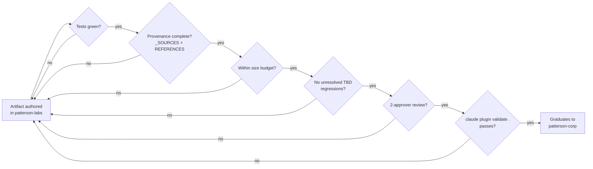

<div align="center">

# patterson-labs

**Trusted Expertise. Unrivaled Support.** — the Patterson incubation marketplace, where
experimental plugins earn their way into `patterson-corp`.


</div>

---

## Table of contents

- [What this is](#what-this-is)
- [Promotion flow](#promotion-flow)
- [Where it fits](#where-it-fits)
- [Plugin catalog](#plugin-catalog)
- [Repository layout](#repository-layout)
- [Quick start](#quick-start)
- [Agentic workflows](#agentic-workflows)
- [Validation](#validation)
- [Status](#status)

## What this is

`patterson-labs` is the **incubating** marketplace: the place experimental plugins live
before they have earned durable, enterprise-wide status. Work here is expected to move —
either up into [`patterson-corp`](../patterson-corp/) once it clears the promotion criteria
in [`docs/promotion-path.md`](docs/promotion-path.md), or to stay incubating indefinitely if
it never does.

> [!NOTE]
> `patterson-labs` also carries the harvest destination for `agentic-workflow-designer` — a
> conversational skill for authoring GitHub Agentic Workflows, judged "the best single
> artifact found in the legacy repos" during the `patterson-skills` retirement review. See
> the [plugin catalog](#plugin-catalog) below.

## Promotion flow



See [`docs/promotion-path.md`](docs/promotion-path.md) for the full criteria, including
where HANDOFF.md 1F leaves a gap and the criterion is recorded as `[TBD]` rather than
invented.

## Where it fits

| Catalog | Role |
|---|---|
| `patterson-corp` | Enterprise — capability true for all of Patterson |
| **`patterson-labs`** | **Incubating — work that has not yet earned durable status (this repo)** |
| `patterson-dental` | Sub-org — segment-particular capability |
| `patterson-vet` | Sub-org — segment-particular capability |

> [!WARNING]
> Marketplace `name` values occupy one **flat global namespace**. Registering a second
> catalog under an existing name replaces the first rather than merging with it — each
> Patterson marketplace repository asserts a distinct name for this reason.

## Plugin catalog

| Plugin | What it is | Skills |
|---|---|---|
| **[`patterson-workflows`](plugins/patterson-workflows/)** | A conversational interview skill that designs one complete GitHub Agentic Workflow `.md` file from a stated goal — trigger, scope, data strategy, guardrails, network, engine. Harvested from `patterson-skills`. | `agentic-workflow-designer` |

## Repository layout

```text
patterson-labs/
├── .claude-plugin/
│   └── marketplace.json          # the catalog agents read
├── plugins/
│   └── patterson-workflows/
│       ├── .claude-plugin/plugin.json
│       └── skills/agentic-workflow-designer/SKILL.md
├── docs/
│   ├── promotion-path.md         # incubation → patterson-corp graduation criteria
│   └── gh-aw-adoption.md         # the org's agentic-workflow adoption position
├── managed-settings.d/           # layered-settings placeholder (incubation tier)
├── tests/
│   └── run-tests.sh              # zero-dependency validation suite
├── .devcontainer/
│   └── devcontainer.json         # node:24, pinned
└── .github/workflows/            # CI + Claude Code Actions + gh-aw workflows
```

## Quick start

```bash
cd patterson-labs
claude
/plugin marketplace add .
/plugin install patterson-workflows@patterson-labs
```

Then ask: *"I want to automate X — help me design a workflow for it."* The
`agentic-workflow-designer` skill runs a structured interview (goal, trigger, scope, data
strategy, guardrails, network, engine) and produces one runnable `gh aw` workflow file.

## Agentic workflows

This repository runs its own `gh aw` weekly incubation review — see
[`docs/gh-aw-adoption.md`](docs/gh-aw-adoption.md) for the org's broader position on
`githubnext/agentics` and `gh-aw`, and `.github/workflows/incubation-review.md` for the
compiled workflow itself.

## Validation

```bash
sh tests/run-tests.sh          # manifest validation, skill name-equals-directory, forbidden content
claude plugin validate .       # the canonical Claude Code plugin-marketplace check
```

<details>
<summary>What the test suite checks</summary>

- `.claude-plugin/marketplace.json` parses as JSON and its `name` is `patterson-labs`
- every plugin `source` begins with `./` and resolves to a real directory
- every `SKILL.md` frontmatter `name` equals its parent directory name — including the
  harvested `agentic-workflow-designer` at its new path
- no forbidden off-brand strings, no legacy Node 20-family image references, no `*.py`
  files, no font binaries, and no emoji on brand surfaces (`README.md`, `docs/**`,
  `marketplace.json`) — scoped so the harvested skill's own emoji usage in its interview
  documentation is not a brand-surface violation

</details>

## Status

| Item | State |
|---|---|
| Plugins | 1 — `patterson-workflows` (harvested skill only) |
| License | none yet — [blocked on an open licensing decision, tracked in `patterson-corp`] |
| Remote repository | not created — this checkout is local-only |
| GitHub-template adoption of `githubnext/agentics` | documented, not executed — [`docs/gh-aw-adoption.md`](docs/gh-aw-adoption.md) |
